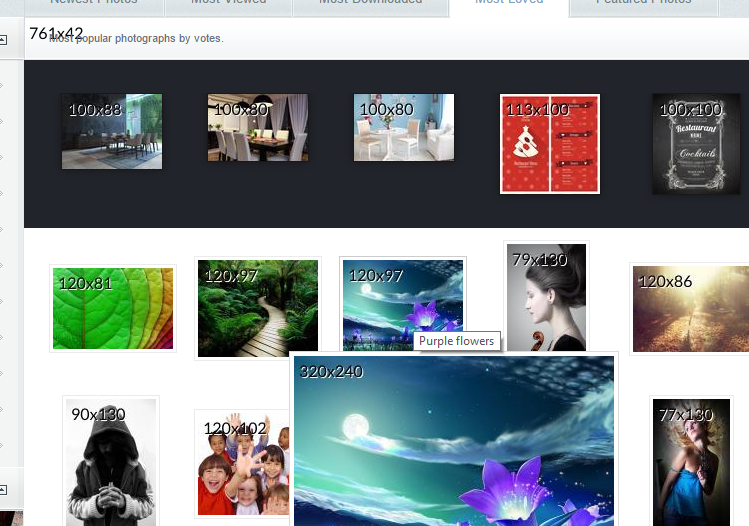

# img-debug-proxy
## Project details
Proxy in Go to help web-developers to deal with images 

Current version is a **proof of concept**. Proxy handles popular image formats and adds a label "\<width\>x\<height\>" at its top-left corner.

The result is like this:



Planned features:

* Parse a special image's URL parameter like "&xxx800x600" - expected dimentions. Check an actual image dimention and mark image correspondingly. 
Generate empty image in case GET fails

* web-admin UI, statistics, etc.

## Dependencies

The project based on two great libaries: [elazarl/goproxy](https://github.com/elazarl/goproxy) and [freetype-go](https://code.google.com/p/freetype-go/). To install dependencies run:

go get github.com/elazarl/goproxy

go get golang.org/x/image/draw

go get code.google.com/p/freetype-go/freetype


## Command line parameters
```
img_debug_proxy -help
Usage of img_debug_proxy:
  -dpi=72: screen resolution in Dots Per Inch
  -fontfile="Lato-Regular.ttf": filename of the ttf font
  -hinting="none": none | full
  -indent=5: label indentation from the top-left image's corner in pixels
  -port="8080": proxy port number
  -size=12: font size in points
  -verbose=false: proxy verbose mode, boolean
```